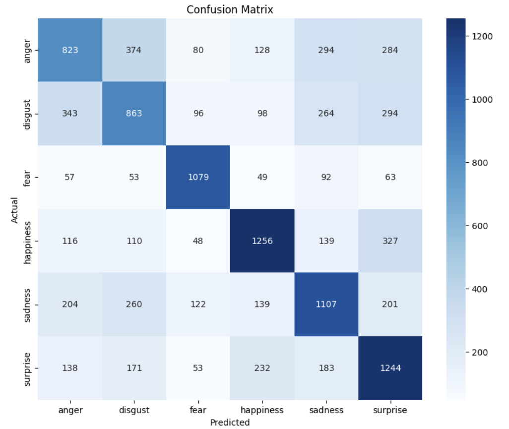

# Emotion classification

1. Load in the textual dataset
2. Encode the labels
3. Train_test_split
4. Tokenize the scenteces and prepare the dataset
5. Train and load pre-trained Roberta model
6. Get some predictions
7. Calculate metrics
8. Plot confusion matrix

## Load in the textual dataset

Load the dataset from a CSV file and remove any rows with missing values to ensure data quality.

```python
import pandas as pd

# Load the data
data_df = pd.read_csv('data/goemotions_cleaned.csv')

# remove the rows with null values
data_df = data_df.dropna()

```

## Encode the labels

Transform the categorical labels into numerical format using label encoding. This is essential for training the model.

```python
from sklearn.preprocessing import LabelEncoder

# Initialize LabelEncoder
label_encoder = LabelEncoder()

# Fit and transform the labels
labels = label_encoder.fit_transform(labels)
```

## Train_test_split

Split the dataset into training and testing sets to evaluate the model's performance effectively.

```python
# Split
from sklearn.model_selection import train_test_split

X_train, X_test, y_train, y_test = train_test_split(sequences, labels, test_size=0.2, random_state=42)
```

## Tokenize the scenteces and prepare the dataset

Tokenize the text data using the pre-trained RoBERTa tokenizer and create TensorFlow datasets for training and validation.

```python
from transformers import RobertaTokenizer, TFRobertaForSequenceClassification

import tensorflow as tf

# Load the pre-trained model
tokenizer = RobertaTokenizer.from_pretrained('roberta-base')
model = TFRobertaForSequenceClassification.from_pretrained('roberta-base', num_labels=6)

# Tokenize the input
train_batch = tokenizer(X_train, padding=True, truncation=True, return_tensors="tf")
val_batch = tokenizer(X_test, padding=True, truncation=True, return_tensors="tf")

# Prepare the datasets
train_dataset = tf.data.Dataset.from_tensor_slices((dict(train_batch), y_train)).shuffle(10000).batch(32)
val_dataset = tf.data.Dataset.from_tensor_slices((dict(val_batch), y_test)).batch(64)
```

## Train and load pre-trained Roberta model

Tokenize the text data using the pre-trained RoBERTa tokenizer and create TensorFlow datasets for training and validation.

```python
optimizer = tf.keras.optimizers.Adam(learning_rate=learning_rate)
loss = tf.keras.losses.SparseCategoricalCrossentropy(from_logits=True)
metric = tf.keras.metrics.SparseCategoricalAccuracy('accuracy')

# Compile the model
model.compile(
    optimizer=optimizer,
    loss=loss,
    metrics=metric,
)

early_stopping = tf.keras.callbacks.EarlyStopping(
    monitor='val_loss',
    mode='min',
    verbose=1,
    patience=4
)

history = model.fit(
    train_dataset,
    epochs=num_epochs,
    batch_size=batch_size,
    validation_data=val_dataset,
    callbacks=[early_stopping]
)
```

## Get some predictions

Use the trained model to make predictions on the validation dataset and obtain the predicted classes.

```python
# Get the predictions
y_pred = model.predict(val_dataset)

# Get the predicted classes
y_pred = np.argmax(y_pred.logits, axis=1)
```
## Calculate metrics

Evaluate the model's performance by calculating accuracy, precision, recall, and F1 score using the predictions.

```python
# Calculate metrics
from sklearn.metrics import accuracy_score, precision_recall_fscore_support, classification_report

# Calculate the metrics
accuracy = accuracy_score(y_test, y_pred)
precision, recall, f1, _ = precision_recall_fscore_support(y_test, y_pred, average='weighted')

print(f'Accuracy: {accuracy}')
print(f'Precision: {precision}')
print(f'Recall: {recall}')
print(f'F1 Score: {f1}')
```

## Plot confusion matrix

Visualize the performance of the model using a confusion matrix to analyze misclassifications.

```python
import seaborn as sns
import matplotlib.pyplot as plt

# with the test data, do error analysis and create a confusion matrix
from sklearn.metrics import confusion_matrix

# Get the confusion matrix
conf_matrix = confusion_matrix(y_test, y_pred)

# Plot the confusion matrix
plt.figure(figsize=(10, 8))
sns.heatmap(conf_matrix, annot=True, fmt='g', cmap='Blues', xticklabels=label_mapping.keys(), yticklabels=label_mapping.keys())
plt.xlabel('Predicted')
plt.ylabel('Actual')
plt.title('Confusion Matrix')
plt.show()
```

