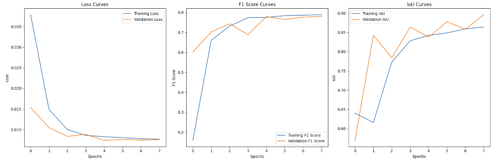
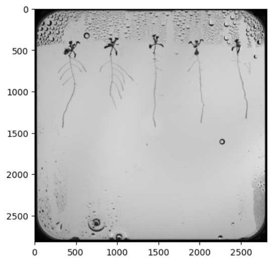
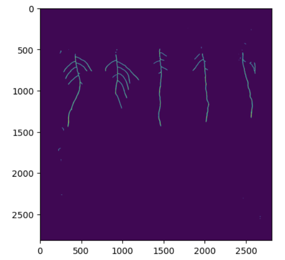

# Training and inference

1. Define custom metrics to evaluate the performance
2. Define function to create U-net model
3. Import the training and validation images and masks
4. Train U-net model with earlystopping
5. Plot relevant metrics to view models performance
6. Performing inference on single image

## Custom Metrics for TensorFlow/Keras Model Evaluation

Defined two custom metrics, **F1 Score** and **Intersection over Union (IoU)**, for model evaluation using TensorFlow and Keras. These metrics are often used in segmentation tasks and classification models to measure the performance of predictions.

```python
def f1(y_true, y_pred):
    def recall_m(y_true, y_pred):
        TP = K.sum(K.round(K.clip(y_true * y_pred, 0, 1)))
        Positives = K.sum(K.round(K.clip(y_true, 0, 1)))
        recall = TP / (Positives+K.epsilon())
        return recall
    
    def precision_m(y_true, y_pred):
        TP = K.sum(K.round(K.clip(y_true * y_pred, 0, 1)))
        Pred_Positives = K.sum(K.round(K.clip(y_pred, 0, 1)))
        precision = TP / (Pred_Positives+K.epsilon())
        return precision
    
    precision, recall = precision_m(y_true, y_pred), recall_m(y_true, y_pred)
    
    return 2*((precision*recall)/(precision+recall+K.epsilon()))

def iou(y_true, y_pred, threshold=0.5):
    def f(y_true, y_pred):
        # Apply threshold to predictions
        y_pred_thresholded = K.cast(K.greater(y_pred, threshold), K.floatx())

        intersection = K.sum(K.abs(y_true * y_pred_thresholded), axis=[1, 2, 3])
        total = K.sum(K.square(y_true), [1, 2, 3]) + K.sum(K.square(y_pred_thresholded), [1, 2, 3])
        union = total - intersection

        return (intersection + K.epsilon()) / (union + K.epsilon())

    return K.mean(f(y_true, y_pred), axis=-1)
```

## Custom U-net model

```python
def simple_unet_model(IMG_HEIGHT: int, IMG_WIDTH: int, IMG_CHANNELS: int)
    """
    Builds and compiles a U-Net model for image segmentation tasks.

    The U-Net model is a type of convolutional neural network designed for
    biomedical image segmentation, but it can be applied to other segmentation
    tasks. It uses an encoder-decoder structure, commonly known as the contraction
    (downsampling) and expansive (upsampling) paths, to capture features at multiple
    resolutions and retain spatial information.

    Parameters:
    ----------
    IMG_HEIGHT (int): 
        Height of the input images. Typically, this should be divisible by 16 to 
        ensure symmetric downsampling and upsampling.
    IMG_WIDTH (int): 
        Width of the input images. Like IMG_HEIGHT, it should ideally be divisible
        by 16 to maintain compatibility with the model architecture.
    IMG_CHANNELS (int): 
        Number of channels of the input images, e.g., 1 for grayscale, 3 for RGB.

    Returns:
    -------
    model (tf.keras.Model): 
        A compiled U-Net model ready for training, with `binary_crossentropy` as 
        the loss function and two custom metrics: Intersection over Union (IoU) 
        and F1 Score.

    Model Architecture:
    -------------------
    - The model is composed of a contraction path with convolutional and dropout
      layers, followed by max pooling for downsampling. 
    - The expansive path consists of transposed convolutions for upsampling,
      concatenation with corresponding feature maps from the contraction path, 
      followed by convolutional layers.
    - At the final layer, a 1x1 convolution with a sigmoid activation is used to 
      generate the output mask.

    Metrics:
    --------
    - IoU: Measures the overlap between predicted and true segmentations, a popular 
      metric in segmentation tasks.
    - F1 Score: The harmonic mean of precision and recall, useful in tasks with
      imbalanced classes.

    Example:
    --------
    >>> model = simple_unet_model(128, 128, 3)
    >>> model.summary()

    Notes:
    ------
    - This model is compiled with the Adam optimizer, which can be adjusted as needed.
    - The input dimensions should be carefully chosen to prevent dimension mismatch
      issues during the upsampling process.
    """
    # Build the model
    inputs = Input((IMG_HEIGHT, IMG_WIDTH, IMG_CHANNELS))
    
    # Contraction path
    c1 = Conv2D(16, (3, 3), activation='relu', kernel_initializer='he_normal', padding='same')(inputs)
    c1 = Dropout(0.1)(c1)
    c1 = Conv2D(16, (3, 3), activation='relu', kernel_initializer='he_normal', padding='same')(c1)
    p1 = MaxPooling2D((2, 2))(c1)
    
    c2 = Conv2D(32, (3, 3), activation='relu', kernel_initializer='he_normal', padding='same')(p1)
    c2 = Dropout(0.1)(c2)
    c2 = Conv2D(32, (3, 3), activation='relu', kernel_initializer='he_normal', padding='same')(c2)
    p2 = MaxPooling2D((2, 2))(c2)
     
    c3 = Conv2D(64, (3, 3), activation='relu', kernel_initializer='he_normal', padding='same')(p2)
    c3 = Dropout(0.2)(c3)
    c3 = Conv2D(64, (3, 3), activation='relu', kernel_initializer='he_normal', padding='same')(c3)
    p3 = MaxPooling2D((2, 2))(c3)
     
    c4 = Conv2D(128, (3, 3), activation='relu', kernel_initializer='he_normal', padding='same')(p3)
    c4 = Dropout(0.2)(c4)
    c4 = Conv2D(128, (3, 3), activation='relu', kernel_initializer='he_normal', padding='same')(c4)
    p4 = MaxPooling2D(pool_size=(2, 2))(c4)
     
    c5 = Conv2D(256, (3, 3), activation='relu', kernel_initializer='he_normal', padding='same')(p4)
    c5 = Dropout(0.3)(c5)
    c5 = Conv2D(256, (3, 3), activation='relu', kernel_initializer='he_normal', padding='same')(c5)
    
    # Expansive path 
    u6 = Conv2DTranspose(128, (2, 2), strides=(2, 2), padding='same')(c5)
    u6 = concatenate([u6, c4])
    c6 = Conv2D(128, (3, 3), activation='relu', kernel_initializer='he_normal', padding='same')(u6)
    c6 = Dropout(0.2)(c6)
    c6 = Conv2D(128, (3, 3), activation='relu', kernel_initializer='he_normal', padding='same')(c6)
     
    u7 = Conv2DTranspose(64, (2, 2), strides=(2, 2), padding='same')(c6)
    u7 = concatenate([u7, c3])
    c7 = Conv2D(64, (3, 3), activation='relu', kernel_initializer='he_normal', padding='same')(u7)
    c7 = Dropout(0.2)(c7)
    c7 = Conv2D(64, (3, 3), activation='relu', kernel_initializer='he_normal', padding='same')(c7)
     
    u8 = Conv2DTranspose(32, (2, 2), strides=(2, 2), padding='same')(c7)
    u8 = concatenate([u8, c2])
    c8 = Conv2D(32, (3, 3), activation='relu', kernel_initializer='he_normal', padding='same')(u8)
    c8 = Dropout(0.1)(c8)
    c8 = Conv2D(32, (3, 3), activation='relu', kernel_initializer='he_normal', padding='same')(c8)
     
    u9 = Conv2DTranspose(16, (2, 2), strides=(2, 2), padding='same')(c8)
    u9 = concatenate([u9, c1], axis=3)
    c9 = Conv2D(16, (3, 3), activation='relu', kernel_initializer='he_normal', padding='same')(u9)
    c9 = Dropout(0.1)(c9)
    c9 = Conv2D(16, (3, 3), activation='relu', kernel_initializer='he_normal', padding='same')(c9)
     
    outputs = Conv2D(1, (1, 1), activation='sigmoid')(c9)
     
    model = Model(inputs=[inputs], outputs=[outputs])
    
    # Compile model
    model.compile(optimizer='adam', loss='binary_crossentropy', metrics=[iou, f1])
    model.summary()
    
    return model
```

## Import the training and validation images and masks 

This section of the code prepares the training and validation image and mask datasets using `ImageDataGenerator` from Keras. The `ImageDataGenerator` class is used to preprocess images, rescale them, and create batches for training a segmentation model.

```python
# import ImageDataGenerator
from keras.preprocessing.image import ImageDataGenerator

# Training images
train_image_datagen = ImageDataGenerator(rescale=1./255)

train_image_generator = train_image_datagen.flow_from_directory(
    f'{patch_dir}/train_images',
    target_size=(patch_size, patch_size),
    batch_size=16,
    class_mode=None,
    color_mode='grayscale',
    seed=42)

# Training masks
train_mask_datagen = ImageDataGenerator()

train_mask_generator = train_mask_datagen.flow_from_directory(
    f'{patch_dir}/train_masks',
    target_size=(patch_size, patch_size),
    batch_size=16,
    class_mode=None,
    color_mode='grayscale',
    seed=42)

train_generator = zip(train_image_generator, train_mask_generator)
```

```python
# val images
val_image_datagen = ImageDataGenerator(rescale=1./255)

val_image_generator = val_image_datagen.flow_from_directory(
    f'{patch_dir}/val_images',
    target_size=(patch_size, patch_size),
    batch_size=16,
    class_mode=None,
    color_mode='grayscale',
    seed=42
)

# val masks
val_mask_datagen = ImageDataGenerator()

val_mask_generator = val_mask_datagen.flow_from_directory(
    f'{patch_dir}/val_masks',
    target_size=(patch_size, patch_size),
    batch_size=16,
    class_mode=None,
    color_mode='grayscale',
    seed=42
)

val_generator = zip(val_image_generator, val_mask_generator)
```

## Train the U-net model with early stopping

This code snippet sets up an early stopping mechanism for training a U-Net model using Keras, which is useful in deep learning to prevent overfitting.

```python
from keras.callbacks import EarlyStopping

model = simple_unet_model(patch_size, patch_size, 1)

cb = EarlyStopping(monitor='val_loss',
                   patience=3,
                   restore_best_weights='True',
                   mode='min')
```

## Plot relevant metrics to view models performance

This Python function, `plot_learning_curves`, visualizes the learning curves of a model during training, using `matplotlib` to create three subplots for loss, F1 score, and Intersection over Union (IoU) metrics over each training epoch. This function is typically used to assess model performance and monitor its improvement over time by plotting both training and validation metrics.

```python
import matplotlib.pyplot as plt
def plot_learning_curves(history: dict) -> None:
    """
    Plots the learning curves of the training and validation accuracy and loss.

    Args:
        history (dict): A dictionary containing the training and validation metrics.
                        Expected keys are 'accuracy', 'val_accuracy', 'loss', and 'val_loss'.

    Returns:
        None
    """
    # Extract relevant metrics from the training history
    train_loss = history.history['loss']
    val_loss = history.history['val_loss']
    train_f1 = history.history['f1']
    val_f1 = history.history['val_f1']
    train_iou = history.history['iou']
    val_iou = history.history['val_iou']

    # Plot the learning curves
    plt.figure(figsize=(18, 6))

    plt.subplot(1, 3, 1)
    plt.plot(train_loss, label='Training Loss')
    plt.plot(val_loss, label='Validation Loss')
    plt.legend()
    plt.title('Loss Curves')
    plt.xlabel('Epochs')
    plt.ylabel('Loss')

    plt.subplot(1, 3, 2)
    plt.plot(train_f1, label='Training F1 Score')
    plt.plot(val_f1, label='Validation F1 Score')
    plt.legend()
    plt.title('F1 Score Curves')
    plt.xlabel('Epochs')
    plt.ylabel('F1 Score')

    plt.subplot(1, 3, 3)
    plt.plot(train_iou, label='Training IoU')
    plt.plot(val_iou, label='Validation IoU')
    plt.legend()
    plt.title('IoU Curves')
    plt.xlabel('Epochs')
    plt.ylabel('IoU')

    plt.tight_layout()
    plt.show()

plot_learning_curves(history)
```


## Performing inference on single image

Load image

```python
image_path = './035_43-17-ROOT1-2023-08-08_mock_pH5_+Fe_Col0_04-Fish Eye Corrected.png'
image = cv2.imread(image_path)
plt.imshow(image, cmap='gray')
```



This code snippet demonstrates the process of dividing an image into smaller patches, predicting a mask for each patch using a trained model, and then reconstructing the full mask from the predicted patches. This approach is common in tasks such as semantic segmentation, where the goal is to classify each pixel in an image.

```python
# Patchify the image into smaller patches
patches = patchify(image, (patch_size, patch_size, 1), step=patch_size)

# Get the number of patches in each dimension
i = patches.shape[0]
j = patches.shape[1]

# Reshape patches to fit the model input
patches = patches.reshape(-1, patch_size, patch_size, 1)

# Predict the mask for each patch
preds = model.predict(patches / 255)

# Reshape the predictions to match the original patch structure
preds = preds.reshape(i, j, patch_size, patch_size)

# Unpatchify the predictions to reconstruct the full mask
predicted_mask = unpatchify(preds, (image.shape[0], image.shape[1]))

# Display the predicted mask
plt.imshow(predicted_mask > 0.5)
```

